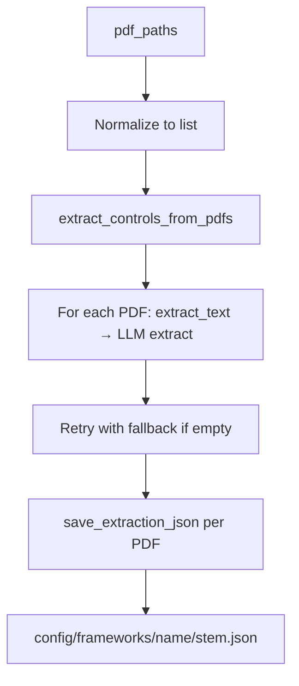
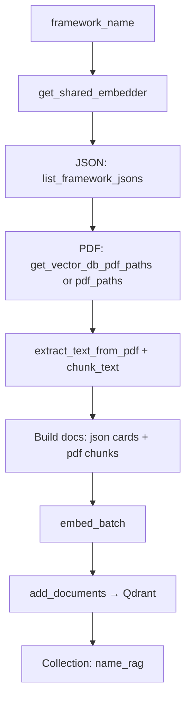
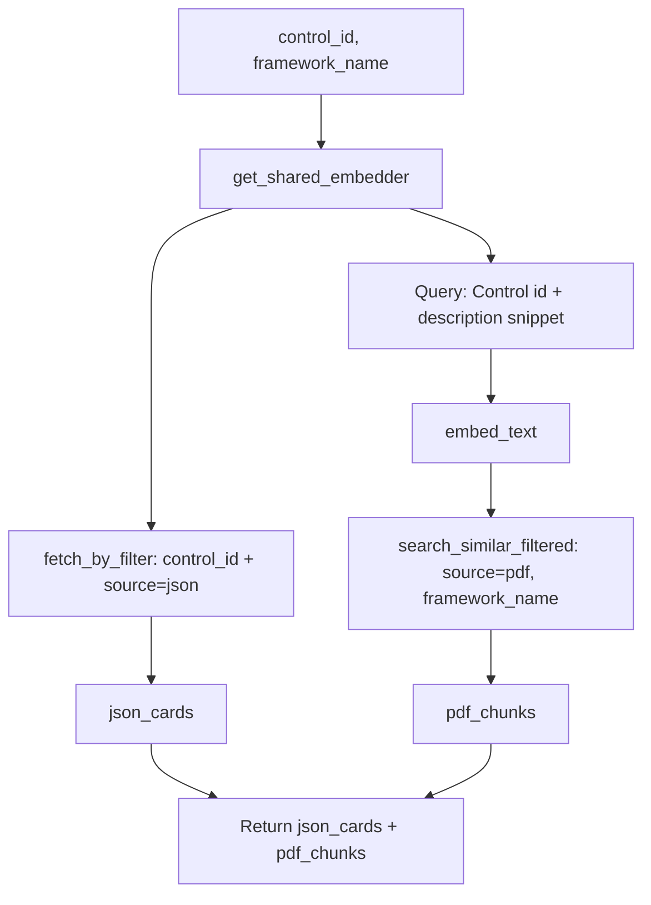

# Code Architecture Documentation

This document explains the codebase structure and serves as the **canonical guide** for future edits. Use it to locate functionality and understand data flows before modifying code.

---

## Overview

The **Compliance Framework Extraction & RAG System** has two main pipelines:

1. **Extraction** – Extract controls from framework PDFs via LLM, save one JSON per PDF. No composition or evaluation prompt generation.
2. **RAG** – Hybrid indexing (JSON control cards + PDF chunks) into Qdrant, and retrieval by control ID (agent-tool friendly).

**Modules**:

| Module | Purpose |
|--------|---------|
| **Core** | Extraction (LLM), retries, and evaluation |
| **Processing** | PDF parsing, text chunking |
| **Embeddings** | Gemma embedder, Qdrant (local/remote) |
| **RAG** | Index framework (JSON + PDF), retrieve by control ID |
| **Utils** | Per-PDF JSON save/load, input paths, vector_db PDF resolution |
| **API** | FastAPI app, routers (frameworks, health), Pydantic models |
| **Services** | Orchestration (FrameworkService for setup_framework) |

**Removed / obsolete**: `prompts/` directory, `compose_master_framework`, `save_framework_data`, `load_framework_data`, `list_saved_frameworks`, `save_evaluation_report`, `generate_evaluation_prompt`. Section organization and multi-PDF validation flows are no longer used.

---

## Directory Structure

```
src/
├── api/                       # FastAPI application layer
│   ├── app.py                 # FastAPI app, CORS, exception handlers
│   ├── routers/
│   │   ├── frameworks.py      # POST /api/v1/frameworks/setup
│   │   └── health.py          # GET /health
│   └── models/
│       ├── requests.py        # (form/file validated in routers)
│       └── responses.py       # ControlSummary, SetupFrameworkResponse, ErrorResponse, ExtractionError
│
├── core/
│   ├── evaluator.py           # Evaluate applicant docs vs framework (uses external prompt)
│   └── framework_extraction.py # extract_controls_from_framework + extract_controls_from_pdfs
│
├── processing/
│   ├── pdf_parser.py          # extract_text_from_pdf
│   └── text_chunker.py        # chunk_text, chunk_text_by_sentences
│
├── embeddings/
│   ├── gemma_embedder.py      # GemmaEmbedder, load_gemma_embedder (HF_HUB_OFFLINE)
│   ├── qdrant_manager.py      # Qdrant CRUD, fetch_by_filter, search_similar_filtered
│   └── haystack_retriever.py  # Haystack + Qdrant (optional)
│
├── rag/
│   ├── _shared.py             # get_shared_embedder() — singleton per process
│   ├── ingestion.py           # index_framework (JSON + PDF → Qdrant)
│   └── retrieval.py           # retrieve_control_details, RETRIEVE_CONTROL_DETAILS_TOOL_SCHEMA
│
├── services/
│   └── framework_service.py   # FrameworkService.setup_framework (orchestration)
│
├── utils/
│   └── framework_utils.py     # save_extraction_json (custom_name), get_input_paths,
│                              # list_framework_jsons, get_vector_db_pdf_paths
│
├── __init__.py                # Package exports
└── ARCHITECTURE.md            # This file
```

**Entry points**: `main.py` (CLI) — `setup_framework()`, `get_input_paths()`. `python src/api/app.py` or `python run.py` — API server.

---

## Module Details

### Core (`src/core/`)

#### `framework_extraction.py`

**Purpose**: Extract compliance controls from PDF text (LLM) and from multiple PDFs in parallel.

**Key functions**:
- `extract_controls_from_framework(pdf_text, framework_name, use_fallback_prompt=False) → dict` — LLM extraction (OpenRouter). Returns `{"framework_name": str, "controls": [ {...}, ... ]}`. Each control has **exactly**: `id`, `description`, `calculation`, `threshold`, `scale`. `use_fallback_prompt=True` for retries (stricter prompt).
- `extract_controls_from_pdfs(pdf_paths_list, framework_name) → list[list[dict]]` — Parallel extraction; one LLM call per PDF; retries with fallback prompt if empty (up to 2 retries). Uses `ThreadPoolExecutor`.

**When to modify**:
- Change extraction prompt or JSON schema; switch LLM (currently `openai/gpt-4.1`); adjust temperature or retry logic.

**Dependencies**: `openai`, `python-dotenv`, `OPENROUTER_API_KEY`; `processing.extract_text_from_pdf`.

---

#### `evaluator.py`

**Purpose**: Evaluate applicant documents against a framework using LLM.

**Key function**: `evaluate_applicant(applicant_docs, evaluation_prompt, controls_json) → dict`

- Uses **externally provided** `evaluation_prompt` and `controls_json`. The extraction pipeline does **not** generate evaluation prompts.

**When to modify**:
- Change evaluation logic or report structure.
- Switch LLM or parameters.

**Dependencies**: OpenAI API, `OPENAI_API_KEY`.

---

### Processing (`src/processing/`)

#### `pdf_parser.py`

**Key function**: `extract_text_from_pdf(pdf_path) → str`

**When to modify**: Change PDF library (`pdfplumber`), add formats, OCR.

---

#### `text_chunker.py`

**Key functions**:
- `chunk_text(text, chunk_size, overlap, framework_name, ...) → list[dict]`
- `chunk_text_by_sentences(text, sentences_per_chunk, ...) → list[dict]`

Chunks include `text`, `metadata` (e.g. `length`). Used by RAG ingestion for PDF chunking.

**When to modify**: Chunk size, overlap, or chunking strategy.

---

### Embeddings (`src/embeddings/`)

#### `gemma_embedder.py`

**Purpose**: Embedding model wrapper (Google EmbeddingGemma 300M via `sentence-transformers`).

**Important**: At module load, **before** any HuggingFace imports:

```python
import os
os.environ["HF_HUB_OFFLINE"] = "1"  # Set to "0" for first-time model download.
```

- **`"1"`** (default): Load from cache only — fast restarts, no hub calls.
- **`"0"`**: Use hub (e.g. first-time download). Change this line in the script when needed, then set back to `"1"`.

**Key**: `GemmaEmbedder`, `load_gemma_embedder(model_name, device, token)`. Methods: `embed_text`, `embed_batch`, `get_embedding_dim`.

**When to modify**:
- Change default model or device.
- Adjust batch size or auth (HF token).
- **Keep** `HF_HUB_OFFLINE` logic; update comment if behaviour changes.

**Dependencies**: `sentence-transformers`, `torch`, `huggingface_hub`.

---

#### `qdrant_manager.py`

**Purpose**: Qdrant vector DB — local (default) or remote.

**Key functions**:
- `initialize_qdrant(collection_name, vector_size, path, url)` — create client and collection.
- `add_documents(client, collection_name, documents, embeddings)` — upsert. **Point IDs**: deterministic UUID from `chunk_id` via `uuid.uuid5` (required by Qdrant). `chunk_id` kept in payload.
- `search_similar(client, collection_name, query_embedding, top_k, score_threshold)` — vector search, no filter.
- `fetch_by_filter(client, collection_name, query_filter, limit)` — **filter-only** lookup (e.g. `control_id` + `source=json`). Uses `scroll`.
- `search_similar_filtered(client, collection_name, query_embedding, top_k, query_filter, score_threshold)` — vector search **with** payload filter. Uses `query_points`.

**When to modify**:
- Change DB (e.g. Pinecone, Weaviate).
- Adjust batch size, distance metric, or filter behaviour.
- **Do not** use arbitrary strings as point IDs; keep UUID derivation from `chunk_id`.

**Dependencies**: `qdrant-client`.

---

#### `haystack_retriever.py`

**Purpose**: Optional Haystack + Qdrant integration.

**When to modify**: Haystack-specific retrieval or pipeline changes.

---

### RAG (`src/rag/`)

#### `_shared.py`

**Purpose**: Single embedder instance per process to avoid repeated model loads.

**Key**: `get_shared_embedder() → GemmaEmbedder`. Caches on first use. Used by `index_framework` and `retrieve_control_details`.

**When to modify**: Only if you change embedder lifecycle (e.g. multi-process).

---

#### `ingestion.py`

**Purpose**: Index a framework for RAG — JSON control cards + PDF chunks.

**Key function**: `index_framework(framework_name, pdf_paths=None) → None`

- **JSON cards**: From `config/frameworks/{framework_name}/*.json`. Each control → one document with `source=json`, `control_id`, `source_pdf` (stem).
- **PDF chunks**: From `data/inputs/vector_db/{framework_name}/*.pdf`, or `vector_db/*.pdf` if no subdir. Override with `pdf_paths` if provided.
- **Collection**: `{framework_name}_rag`.
- Uses `get_shared_embedder()`, `list_framework_jsons`, `get_vector_db_pdf_paths`, `extract_text_from_pdf`, `chunk_text`, `add_documents`.

**When to modify**:
- Change JSON vs PDF sourcing or payload schema.
- Change collection naming or embedder usage.

---

#### `retrieval.py`

**Purpose**: Retrieve control details by ID — JSON cards + relevant PDF chunks. **Agent-tool friendly.**

**Key function**: `retrieve_control_details(control_id, framework_name, *, top_k_pdf=5) → dict`

- **JSON**: `fetch_by_filter` with `control_id` + `source=json`.
- **PDF**: Semantic search over `source=pdf` + `framework_name` using `search_similar_filtered`. Query = `"Control {id}. {description_snippet}"`.

**Returns**: `{"json_cards": [...], "pdf_chunks": [...]}`. Each item has `text` and `metadata`; chunks also have `score`.

**Tool schema**: `RETRIEVE_CONTROL_DETAILS_TOOL_SCHEMA` — use for OpenAI tools, LangChain, etc.

**When to modify**:
- Change filter logic, query construction, or `top_k_pdf`.
- Update tool schema if API changes.

---

### Utils (`src/utils/`)

#### `framework_utils.py`

**Key functions**:
- `save_extraction_json(framework_name, pdf_path, controls_json, custom_name=None) → Path` — save under `config/frameworks/{framework_name}/{stem}.json`. Use `custom_name` for section name when provided; otherwise PDF stem.
- `get_input_paths() → dict` — `frameworks`, `applicants`, `vector_db` under `data/inputs/`.
- `list_framework_jsons(framework_name) → list[(stem, dict)]` — load all `*.json` for a framework.
- `get_vector_db_pdf_paths(framework_name) → list[Path]` — PDFs in `data/inputs/vector_db/`; prefers `vector_db/{framework_name}/` then flat `vector_db/*.pdf`.

**When to modify**: Storage paths, file naming, or vector_db resolution.

---

### API (`src/api/`)

**Purpose**: FastAPI application layer — CORS, routers, Pydantic models, exception handlers.

**Key**:
- `app.py` — FastAPI app; includes health and frameworks routers; handlers for `ExtractionError` (500), `ValueError` (400).
- `routers/frameworks.py` — `POST /api/v1/frameworks/setup`: form `framework_name`, `section_names[]`, `files[]` (PDFs). Validates, calls `FrameworkService.setup_framework`, returns `SetupFrameworkResponse`.
- `routers/health.py` — `GET /health` → `{"status": "ok"}`.
- `models/responses.py` — `ControlSummary`, `SetupFrameworkResponse`, `ErrorResponse`, `ExtractionError`.

**Run**: From `ai-service/`: `python src/api/app.py` or `python run.py`. Docs: `/api/docs`, `/api/redoc`.

---

### Services (`src/services/`)

**Purpose**: Orchestration for API and CLI.

**Key**: `framework_service.py` — `FrameworkService.setup_framework(framework_name, pdf_sections: list[tuple[str, bytes]])`. Saves PDFs to temp dir, calls `extract_controls_from_pdfs`, saves JSON per section via `save_extraction_json(..., custom_name=section_name)`, returns summary; cleans up temp dir. Used by `main.py` (CLI) and `POST /api/v1/frameworks/setup`.

---

## Data Flows

### 1. Extraction pipeline (`setup_framework`)

**Function**: `setup_framework(pdf_paths: str | list[str], framework_name: str) → list[Path]`



**Steps**:
1. Normalize input (file, list, or directory) → list of PDF paths.
2. `extract_controls_from_pdfs` → parallel extraction, retry on empty.
3. For each PDF: `{"framework_name", "controls"}` → `save_extraction_json` → `config/frameworks/{framework_name}/{stem}.json`.

**No** composition, evaluation prompt generation, or framework metadata files.

---

### 2. RAG indexing (`index_framework`)

**Function**: `index_framework(framework_name, pdf_paths=None)`



**Storage**:
- **JSON cards**: `config/frameworks/{framework_name}/*.json`.
- **PDFs**: `data/inputs/vector_db/{framework_name}/` or `vector_db/`.

---

### 3. RAG retrieval (`retrieve_control_details`)

**Function**: `retrieve_control_details(control_id, framework_name, top_k_pdf=5)`



Use `RETRIEVE_CONTROL_DETAILS_TOOL_SCHEMA` when registering as an agent tool.

---

## Common Modification Scenarios

| Goal | Files to change |
|------|------------------|
| **LLM model (extraction)** | `core/framework_extraction.py` — model, base_url |
| **LLM model (evaluation)** | `core/evaluator.py` |
| **Embedding model** | `embeddings/gemma_embedder.py` — `model_name`, `get_embedding_dim` |
| **Chunking** | `processing/text_chunker.py` — `chunk_text` params |
| **HF offline default** | `embeddings/gemma_embedder.py` — `HF_HUB_OFFLINE` line + comment |
| **Storage paths** | `utils/framework_utils.py` |
| **Qdrant path** | `embeddings/qdrant_manager.py` — `initialize_qdrant` default path |
| **RAG JSON/PDF sources** | `rag/ingestion.py`, `utils/framework_utils.py` |
| **Retrieval filters / top_k** | `rag/retrieval.py` |
| **Tool schema for agents** | `rag/retrieval.py` — `RETRIEVE_CONTROL_DETAILS_TOOL_SCHEMA` |

---

## Environment Variables

| Variable | Used by | Purpose |
|----------|---------|---------|
| `OPENROUTER_API_KEY` | `framework_extraction.py` | LLM extraction (OpenRouter) |
| `OPENROUTER_API_KEY` | `framework_extraction.py`, `evaluator.py` | LLM extraction and legacy evaluation |
| `HF_TOKEN` or `HUGGINGFACE_TOKEN` | `gemma_embedder.py` | Gated models (when not offline) |
| `HF_HUB_OFFLINE` | Set in `gemma_embedder.py` | `"1"` cache-only, `"0"` hub access |

---

## Dependencies Overview

| Module | Key dependencies |
|--------|-------------------|
| `core/` | `openai`, `python-dotenv` |
| `processing/` | `pdfplumber` |
| `embeddings/` | `sentence-transformers`, `torch`, `qdrant-client`, `huggingface_hub` |
| `rag/` | (uses `embeddings`, `utils`, `processing`) |
| `utils/` | stdlib only |

---

## Entry Points and Imports

**`main.py`**:
- `setup_framework(pdf_paths, framework_name)` — extract + save per-PDF JSON.
- `get_input_paths()` — frameworks, applicants, vector_db dirs.

**Typical imports**:

```python
from src import (
    setup_framework,
    extract_controls_from_framework,
    extract_controls_from_pdfs,
    index_framework,
    retrieve_control_details,
    RETRIEVE_CONTROL_DETAILS_TOOL_SCHEMA,
    get_shared_embedder,
    save_extraction_json,
    get_input_paths,
    list_framework_jsons,
    get_vector_db_pdf_paths,
    extract_text_from_pdf,
    chunk_text,
)
```

---

## Implementation Notes (memorise for edits)

1. **Extraction is extract-only**: One JSON per PDF. No master composition, no evaluation prompt generation.
2. **Control schema**: Exactly `id`, `description`, `calculation`, `threshold`, `scale`. Enforced in `framework_extraction` prompts.
3. **Retries**: Empty extraction → up to 2 retries with `use_fallback_prompt=True` in `framework_extraction.extract_controls_from_pdfs`.
4. **Embedder**: `HF_HUB_OFFLINE=1` in script by default. Set to `"0"` only for first-time download; then revert.
5. **Shared embedder**: `get_shared_embedder()` used by both `index_framework` and `retrieve_control_details`. Single load per process.
6. **Qdrant point IDs**: Must be UUIDs. Use `uuid.uuid5(namespace, chunk_id)`. Store `chunk_id` in payload.
7. **RAG collection**: `{framework_name}_rag`. Payload includes `source` (`json` | `pdf`), `control_id`, `framework_name`, `source_pdf`.
8. **Vector DB PDF input**: `data/inputs/vector_db/`. Prefer `vector_db/{framework_name}/*.pdf`, else `vector_db/*.pdf`.
9. **Framework JSON output**: `config/frameworks/{framework_name}/{pdf_stem}.json`.

---

*Paths are relative to project root `services/ai-service/`. Configuration and data directories are created as needed. Use this document as the primary reference when editing the codebase.*
