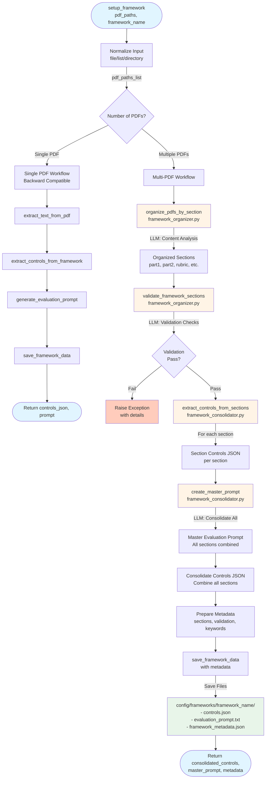
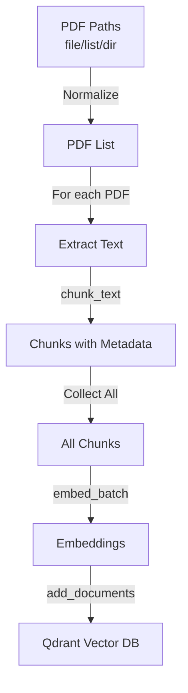
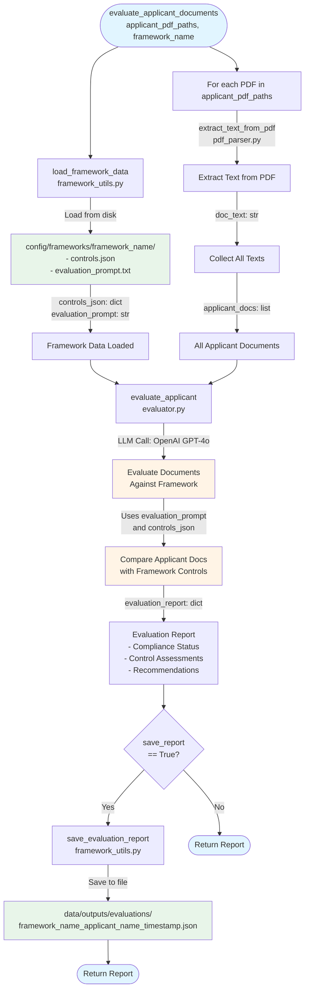

# Code Architecture Documentation

This document explains the codebase structure and where to find specific functionality when making adjustments.

## Overview

The Compliance Framework Evaluation System is organized into logical modules that handle different aspects of the pipeline:

1. **Core** - Business logic for framework extraction and evaluation
2. **Processing** - Document parsing and text chunking
3. **Embeddings** - Vector embeddings and database operations
4. **Prompts** - LLM prompt generation
5. **Utils** - File I/O and data management

## Directory Structure

```
src/
├── core/                    # Core business logic
│   ├── evaluator.py        # Document evaluation against frameworks
│   └── framework_extractor.py  # Extract controls from framework PDFs
│
├── processing/             # Document processing pipeline
│   ├── pdf_parser.py       # PDF text extraction
│   └── text_chunker.py     # Text chunking for embeddings
│
├── embeddings/             # Vector operations and storage
│   ├── gemma_embedder.py   # Embedding model wrapper
│   ├── qdrant_manager.py   # Vector database operations
│   └── haystack_retriever.py  # Haystack integration
│
├── prompts/                # Prompt management
│   └── prompt_generator.py # Generate evaluation prompts
│
└── utils/                  # Utilities and helpers
    └── framework_utils.py  # Framework data save/load
```

---

## Module Details

### Core (`src/core/`)

**Purpose**: Contains the main business logic for framework extraction and document evaluation.

#### `framework_extractor.py`
**What it does**: Extracts compliance controls from framework PDF text using LLM.

**Key Functions**:
- `extract_controls_from_framework(pdf_text, framework_name)` - Main extraction function

**When to modify**:
- To change how controls are extracted
- To adjust the extraction prompt structure
- To modify the output JSON schema
- To change the LLM model or parameters

**Dependencies**: OpenAI API, requires `OPENAI_API_KEY` environment variable

#### `framework_organizer.py`
**What it does**: Organizes multiple PDFs into sections using LLM content analysis and validates framework completeness.

**Key Functions**:
- `organize_pdfs_by_section(pdf_paths_list, framework_name)` - Analyzes PDF content to determine section names (part1, part2, rubric, etc.)
- `validate_framework_sections(organized_sections, framework_name)` - Validates sections for completeness, quality, keywords, and control patterns

**When to modify**:
- To change section identification logic
- To adjust validation criteria
- To modify section naming conventions
- To add custom validation checks

**Dependencies**: OpenAI API, requires `OPENAI_API_KEY` environment variable

#### `framework_consolidator.py`
**What it does**: Extracts controls from each section and creates a master evaluation prompt consolidating all sections.

**Key Functions**:
- `extract_controls_from_sections(organized_sections, framework_name)` - Extracts controls from each section individually
- `create_master_prompt(section_controls, organized_sections, framework_name)` - Consolidates all sections into unified master prompt

**When to modify**:
- To change master prompt structure
- To adjust consolidation logic
- To modify how controls are combined
- To change prompt formatting

**Dependencies**: OpenAI API, requires `OPENAI_API_KEY` environment variable

#### `framework_organizer.py`
**What it does**: Organizes multiple PDFs into sections using LLM content analysis and validates framework completeness.

**Key Functions**:
- `organize_pdfs_by_section(pdf_paths_list, framework_name)` - Analyzes PDF content to determine section names (part1, part2, rubric, etc.)
- `validate_framework_sections(organized_sections, framework_name)` - Validates sections for completeness, quality, keywords, and control patterns

**When to modify**:
- To change section identification logic
- To adjust validation criteria
- To modify section naming conventions
- To add custom validation checks

**Dependencies**: OpenAI API, requires `OPENAI_API_KEY` environment variable

#### `framework_consolidator.py`
**What it does**: Extracts controls from each section and creates a master evaluation prompt consolidating all sections.

**Key Functions**:
- `extract_controls_from_sections(organized_sections, framework_name)` - Extracts controls from each section individually
- `create_master_prompt(section_controls, organized_sections, framework_name)` - Consolidates all sections into unified master prompt

**When to modify**:
- To change master prompt structure
- To adjust consolidation logic
- To modify how controls are combined
- To change prompt formatting

**Dependencies**: OpenAI API, requires `OPENAI_API_KEY` environment variable

#### `evaluator.py`
**What it does**: Evaluates applicant documents against saved frameworks using LLM.

**Key Functions**:
- `evaluate_applicant(applicant_docs, evaluation_prompt, controls_json)` - Main evaluation function

**When to modify**:
- To change evaluation logic
- To adjust evaluation prompt format
- To modify the evaluation report structure
- To change the LLM model or temperature settings

**Dependencies**: OpenAI API, requires `OPENAI_API_KEY` environment variable

---

### Processing (`src/processing/`)

**Purpose**: Handles document parsing and text preparation for further processing.

#### `pdf_parser.py`
**What it does**: Extracts text from PDF files with multilingual support (Arabic/English).

**Key Functions**:
- `extract_text_from_pdf(pdf_path)` - Extracts all text from a PDF file
  - Used individually for each PDF when processing multiple files

**When to modify**:
- To change PDF extraction library (currently uses `pdfplumber`)
- To add support for other file formats (Word, images, etc.)
- To improve multilingual text extraction
- To add OCR capabilities

**Dependencies**: `pdfplumber`

#### `text_chunker.py`
**What it does**: Splits text into chunks with overlap for vector database storage.

**Key Functions**:
- `chunk_text(text, chunk_size, overlap, framework_name)` - Main chunking function
- `chunk_text_by_sentences(text, sentences_per_chunk)` - Alternative sentence-based chunking
- `_is_valid_chunk(text)` - Validates chunks (filters formatting artifacts)

**When to modify**:
- To adjust chunk size or overlap parameters
- To change chunking strategy (by paragraphs, sections, etc.)
- To improve semantic boundary detection
- To modify chunk validation logic
- To add custom chunking algorithms

**Dependencies**: None (pure Python)

---

### Embeddings (`src/embeddings/`)

**Purpose**: Handles embedding generation and vector database operations.

#### `gemma_embedder.py`
**What it does**: Wraps Google EmbeddingGemma 300M model for generating embeddings.

**Key Classes**:
- `GemmaEmbedder` - Main embedder class

**Key Methods**:
- `embed_text(text)` - Generate embedding for single text
- `embed_batch(texts, batch_size)` - Generate embeddings for multiple texts
- `get_embedding_dim()` - Get embedding dimension

**When to modify**:
- To change the embedding model (e.g., switch to different HuggingFace model)
- To adjust batch processing parameters
- To add GPU/CPU optimization
- To change authentication method
- To add caching for embeddings

**Dependencies**: `sentence-transformers`, `torch`, `huggingface_hub`

#### `qdrant_manager.py`
**What it does**: Manages Qdrant vector database operations (local or remote).

**Key Functions**:
- `initialize_qdrant(collection_name, vector_size, path, url)` - Initialize client and create collection
- `add_documents(client, collection_name, documents, embeddings)` - Store documents with embeddings
- `search_similar(client, collection_name, query_embedding, top_k)` - Search for similar documents
- `create_collection(client, collection_name, vector_size)` - Create new collection
- `delete_collection(client, collection_name)` - Delete collection

**When to modify**:
- To change vector database (e.g., switch to Pinecone, Weaviate)
- To adjust batch size for document insertion
- To modify search parameters (distance metric, filters)
- To add collection management features
- To change storage location or configuration

**Dependencies**: `qdrant-client`

#### `haystack_retriever.py`
**What it does**: Integrates Haystack AI framework with Qdrant for document retrieval.

**Key Classes**:
- `HaystackQdrantRetriever` - Retriever class combining Haystack and Qdrant

**When to modify**:
- To change retrieval strategy
- To integrate different Haystack components
- To modify document loading from Qdrant
- To add filtering or ranking logic

**Dependencies**: `haystack-ai`, `qdrant-client`

---

### Prompts (`src/prompts/`)

**Purpose**: Manages prompt generation for LLM interactions.

#### `prompt_generator.py`
**What it does**: Generates evaluation prompts from extracted controls JSON.

**Key Functions**:
- `generate_evaluation_prompt(controls_json, framework_name)` - Generate evaluation prompt

**When to modify**:
- To change prompt structure or format
- To adjust prompt generation instructions
- To modify LLM model or parameters
- To add prompt templates or variations
- To customize prompts for different framework types

**Dependencies**: OpenAI API, requires `OPENAI_API_KEY` environment variable

---

### Utils (`src/utils/`)

**Purpose**: Provides utility functions for data persistence and path management.

#### `framework_utils.py`
**What it does**: Handles saving/loading framework data and evaluation reports.

**Key Functions**:
- `save_framework_data(framework_name, controls_json, evaluation_prompt)` - Save framework to disk
- `load_framework_data(framework_name)` - Load framework from disk
- `list_saved_frameworks()` - List all saved frameworks
- `save_evaluation_report(evaluation_report, framework_name, applicant_name)` - Save evaluation report
- `get_input_paths()` - Get standard input directory paths

**When to modify**:
- To change storage location or format
- To add database integration (instead of file system)
- To modify file naming conventions
- To add metadata management
- To change data serialization format

**Storage Locations**:
- Frameworks: `config/frameworks/{framework_name}/`
- Evaluation reports: `data/outputs/evaluations/`
- Input PDFs: `data/inputs/frameworks/` and `data/inputs/applicants/`
- Vector DB input PDFs: `data/inputs/vector_db/`

**Dependencies**: None (standard library only)

---

## Data Flow

### Framework Setup Pipeline

**Function**: `setup_framework(pdf_paths: str | list[str], framework_name: str)`

Extracts compliance controls from framework PDF(s) and generates evaluation prompts. Supports single PDF (backward compatible) or multiple PDFs with section organization and consolidation.



**Detailed Steps (Multi-PDF Workflow)**:
1. **Input Normalization**: Normalize to list of PDF paths (handles single file/list/directory)
2. **Section Organization**: `organize_pdfs_by_section()` → LLM analyzes each PDF content to determine section names (part1, part2, rubric, etc.)
3. **Validation**: `validate_framework_sections()` → LLM validates:
   - Completeness (all required sections present)
   - Text quality (readable, not corrupted)
   - Keywords (compliance keywords detected)
   - Control patterns (compliance patterns identified)
   - Structure (proper document structure)
4. **Control Extraction**: `extract_controls_from_sections()` → Extract controls from each section individually
5. **Master Prompt Creation**: `create_master_prompt()` → LLM consolidates all sections into unified master prompt with:
   - Full text from each section
   - Combined controls
   - Unified evaluation rules
   - Rubric/scoring criteria
6. **Consolidation**: Combine all section controls into single controls JSON
7. **Save**: `save_framework_data()` → saves controls, master prompt, and metadata to `config/frameworks/{framework_name}/`

**Note**: Single PDF workflow maintains backward compatibility. The same PDF file(s) can be indexed into the vector database using `index_framework_documents()`.

---

### Document Indexing Pipeline

**Function**: `index_framework_documents(pdf_paths: str | list[str], framework_name: str)`

Processes PDF documents and stores them in a vector database. **The same PDF files from Framework Setup can be indexed here.**



**Steps**:
1. Normalize input (single file/list/directory) → `pdf_paths_list`
2. For each PDF: extract text → chunk → add source metadata
3. Generate embeddings for all chunks (batch)
4. Store in Qdrant at `config/vector_db/collection/{framework_name}_chunks/`

**Returns**: `(qdrant_client, collection_name, embedder)`

---

### Evaluation Pipeline

**Function**: `evaluate_applicant_documents(applicant_pdf_paths: list[str], framework_name: str, applicant_name: str = None, save_report: bool = True)`

Evaluates applicant documents against a previously set up framework.



**Detailed Steps**:
1. **Load Framework**: `load_framework_data(framework_name)` → loads `controls_json` and `evaluation_prompt` from saved files
2. **Extract Applicant Text**: For each PDF in `applicant_pdf_paths`:
   - `extract_text_from_pdf(pdf_path)` → extracts text
   - Collects all texts into `applicant_docs` list
3. **Evaluate**: `evaluate_applicant(applicant_docs, evaluation_prompt, controls_json)` → LLM:
   - Uses the evaluation prompt as instructions
   - Compares applicant documents against framework controls
   - Generates compliance assessment for each control
4. **Save Report** (optional): `save_evaluation_report()` → saves JSON report to `data/outputs/evaluations/`

---

## Common Modification Scenarios

### Change LLM Model

**Files to modify**:
- `core/framework_extractor.py` - Line 92: `model="gpt-4o"`
- `core/evaluator.py` - Line 60: `model="gpt-4o"`
- `prompts/prompt_generator.py` - Line 61: `model="gpt-4o"`

### Adjust Chunking Strategy

**Files to modify**:
- `processing/text_chunker.py` - Modify `chunk_text()` function
- Default parameters: `chunk_size=1500`, `overlap=200`

### Change Embedding Model

**Files to modify**:
- `embeddings/gemma_embedder.py` - Line 22: `model_name="google/embeddinggemma-300m"`
- Update `get_embedding_dim()` return value if dimension changes

### Modify Storage Location

**Files to modify**:
- `utils/framework_utils.py` - Update path construction in all functions
- `embeddings/qdrant_manager.py` - Line 35: Update default path

### Add New File Format Support

**Files to modify**:
- `processing/pdf_parser.py` - Add new extraction function
- Update `main.py` to use new function

### Change Evaluation Criteria

**Files to modify**:
- `prompts/prompt_generator.py` - Modify prompt generation instructions
- `core/evaluator.py` - Modify evaluation request format

---

## Environment Variables

Required environment variables:

- `OPENAI_API_KEY` - Used by:
  - `core/framework_extractor.py`
  - `core/evaluator.py`
  - `prompts/prompt_generator.py`

- `HF_TOKEN` or `HUGGINGFACE_TOKEN` - Used by:
  - `embeddings/gemma_embedder.py` (for gated models)

---

## Dependencies Overview

| Module | Key Dependencies |
|--------|------------------|
| `core/` | `openai`, `python-dotenv` |
| `processing/` | `pdfplumber` |
| `embeddings/` | `sentence-transformers`, `torch`, `qdrant-client`, `haystack-ai` |
| `prompts/` | `openai`, `python-dotenv` |
| `utils/` | None (standard library) |

---

## Testing and Debugging Tips

1. **Test PDF parsing**: Use `processing/pdf_parser.py` directly with a test PDF
2. **Test chunking**: Pass sample text to `processing/text_chunker.py` functions
3. **Test embeddings**: Create `GemmaEmbedder()` instance and test `embed_text()`
4. **Test Qdrant**: Use `embeddings/qdrant_manager.py` functions with test data
5. **Test LLM calls**: Run individual functions from `core/` and `prompts/` modules

---

## Entry Point

The main entry point is `main.py` in the project root, which demonstrates the complete pipeline:

- `setup_framework()` - Setup a new framework
- `index_framework_documents(pdf_paths, framework_name)` - Index documents for vector search
  - Supports single file path, list of file paths, or directory path
  - Each PDF is processed individually (extract → chunk)
  - All chunks are embedded together and stored in Qdrant
  - Each chunk includes source PDF metadata
- `evaluate_applicant_documents()` - Evaluate applicant documents

All functions can be imported and used independently:

```python
from src.core import extract_controls_from_framework, evaluate_applicant
from src.processing import extract_text_from_pdf, chunk_text
from src.embeddings import GemmaEmbedder, initialize_qdrant
```

---

## Notes

- All paths are relative to project root (`services/ai-service/`)
- Configuration and data directories are created automatically
- Error handling is minimal - exceptions propagate to caller
- No logging framework - add if needed for production use


