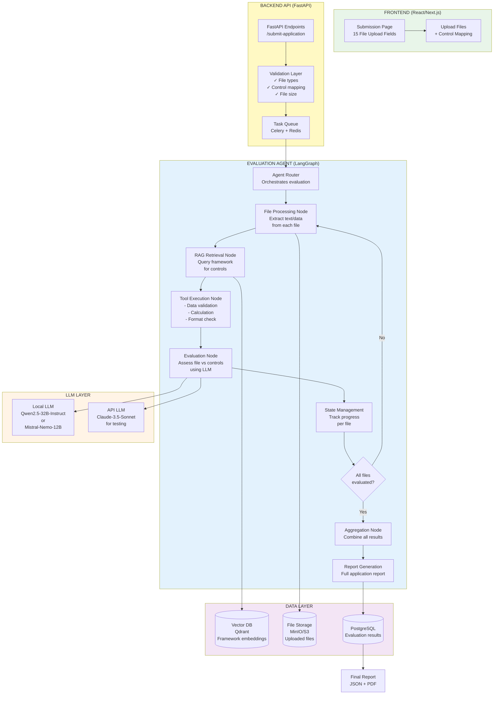
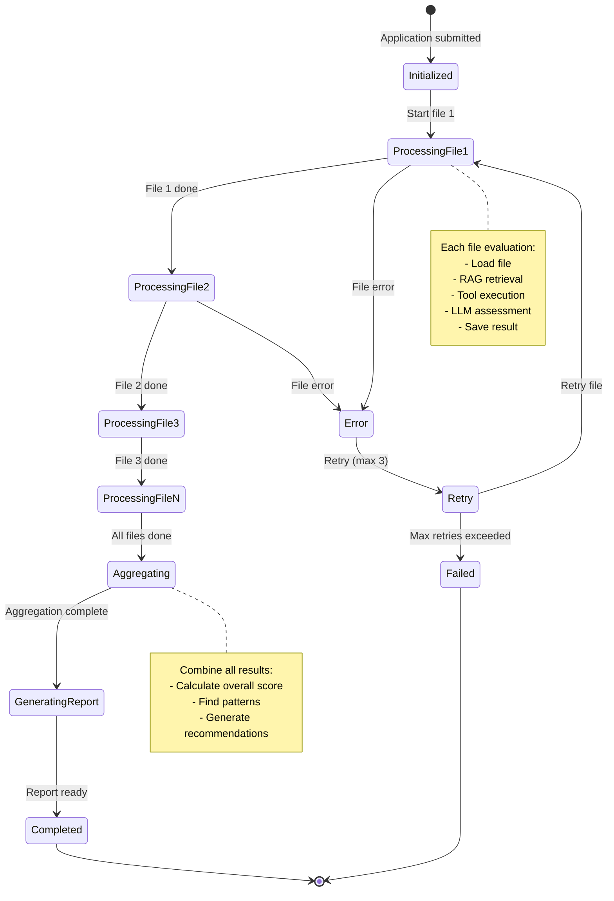

# Evaluation Agent System Design
## Multi-File Compliance Evaluation with RAG & Tool Integration

> **Note:** This document is an aspirational design proposal. The implemented system uses a synchronous Groq-based LangGraph agent without Celery, MinIO, or a locally hosted LLM. See [`src/ARCHITECTURE.md`](src/ARCHITECTURE.md) and [`src/agent/graph.py`](src/agent/graph.py) for what is actually built.

---

## 🎯 System Overview

### High-Level Flow
```
Frontend Submission Page
    ↓
15 File Upload Fields (CSV, PPTX, DOCX, PDF, XLSX)
    ↓
Backend receives: {file1: [control_ids], file2: [control_ids], ...}
    ↓
Evaluation Agent (RAG + Tools)
    ↓
Evaluates each file against assigned controls
    ↓
Generates comprehensive application report
```

---

## 📋 Requirements Analysis

### What You Need
✅ **Multi-file evaluation** - Handle 15 files per application
✅ **Control-specific assessment** - Each file evaluated against specific controls
✅ **Document understanding** - Process CSV, PPTX, DOCX, PDF, XLSX
✅ **RAG integration** - Query framework knowledge
✅ **Tool usage** - Extract, analyze, compute from documents
✅ **Comprehensive reporting** - Full application assessment
✅ **Local deployment** - Run on-premises for client security
✅ **API access** - For testing and development
✅ **Arabic support** - Handle Arabic documents
✅ **Reliable performance** - Consistent, production-grade

### Critical Constraints
⚠️ **NOT 200B parameters** - Must be deployable locally
⚠️ **NO Google models** - Avoid Gemini/PaLM
⚠️ **Document context** - Large context window required
⚠️ **Arabic capable** - Strong Arabic language support

---

## 🏗️ RECOMMENDED ARCHITECTURE



---

## 🔧 TECHNOLOGY STACK (RECOMMENDED)

### Frontend
```
Framework:     Next.js 14 (React)
UI Library:    shadcn/ui + Tailwind CSS
File Upload:   react-dropzone
State:         Zustand or React Query
Why:           Modern, fast, great file handling
```

### Backend API
```
Framework:     FastAPI (Python 3.11+)
Task Queue:    Celery + Redis
File Storage:  MinIO (S3-compatible) or local filesystem
Auth:          JWT + OAuth2
Why:           Async support, fast, easy integration with Python ML stack
```

### Agent Framework
```
Framework:     LangGraph (NOT LangChain)
State:         LangGraph's built-in state management
Orchestration: Graph-based agent workflow
Why:           Better control flow than LangChain, explicit state, debuggable
```

### Vector Database
```
Database:      Qdrant (Local or Cloud)
Embeddings:    multilingual-e5-large-instruct (1024 dim)
Alternative:   jina-embeddings-v3 (Arabic-strong)
Why:           Fast, local deployment, good filtering, open source
```

### LLM Selection (CRITICAL CHOICE)

#### For Local Deployment (Production)
**Option 1: Qwen2.5-32B-Instruct** ⭐ RECOMMENDED
```
Model:         Alibaba Qwen2.5-32B-Instruct
Parameters:    32B (manageable on local GPU)
Context:       32K tokens (excellent for documents)
Arabic:        ⭐⭐⭐⭐⭐ Native Arabic support
Languages:     29 languages including Arabic
Deployment:    vLLM or Ollama
Hardware:      2x RTX 4090 (48GB) or A100 (40GB)
Cost:          Free (self-hosted)
Reliability:   ⭐⭐⭐⭐⭐ Production-grade
License:       Apache 2.0 (commercial use OK)
Why:           Best balance: size, Arabic, documents, reliability
```

**Option 2: Mistral-Nemo-12B-Instruct** (Lighter alternative)
```
Model:         Mistral AI Nemo 12B Instruct
Parameters:    12B (runs on single RTX 4090)
Context:       128K tokens (massive context!)
Arabic:        ⭐⭐⭐ Decent (multilingual training)
Deployment:    vLLM or Ollama
Hardware:      Single RTX 4090 (24GB) or RTX A6000
Cost:          Free (self-hosted)
Reliability:   ⭐⭐⭐⭐ Very good
License:       Apache 2.0
Why:           Lighter, huge context, easier deployment
```

**Option 3: Command-R+ 104B** (If you have resources)
```
Model:         Cohere Command-R+ 104B
Parameters:    104B (requires beefy hardware)
Context:       128K tokens
Arabic:        ⭐⭐⭐⭐⭐ Excellent
Deployment:    TensorRT-LLM (optimized)
Hardware:      4x A100 (80GB) or equivalent
Cost:          Free (self-hosted)
Why:           Best quality, but heavy
```

#### For API Testing (Development)
**Claude-3.5-Sonnet** ⭐ RECOMMENDED FOR TESTING
```
Provider:      Anthropic
Context:       200K tokens (huge for documents)
Arabic:        ⭐⭐⭐⭐ Very good
Cost:          $3/$15 per 1M tokens (in/out)
Reliability:   ⭐⭐⭐⭐⭐ Best-in-class
Why:           Best for testing, excellent reasoning, great with documents
```

**Alternative: GPT-4o**
```
Provider:      OpenAI
Context:       128K tokens
Arabic:        ⭐⭐⭐⭐ Very good
Cost:          $2.50/$10 per 1M tokens
Why:           Widely used, reliable, good Arabic
```

### Document Processing
```
PDF:           PyMuPDF (fast) or pdfplumber (tables)
DOCX:          python-docx
XLSX:          openpyxl or pandas
PPTX:          python-pptx
CSV:           pandas
OCR (if needed): Tesseract + surya (Arabic OCR)
```

### Database
```
Main DB:       PostgreSQL 15+
Cache:         Redis 7+
Vector DB:     Qdrant
Why:           Reliable, battle-tested, great performance
```

### Deployment
```
Containerization: Docker + Docker Compose
Orchestration:    Kubernetes (optional for scaling)
LLM Serving:      vLLM (fast inference) or Ollama (easier)
Monitoring:       Prometheus + Grafana
Why:              Industry standard, reliable, scalable
```

---

## 🎨 DETAILED SYSTEM DESIGN

### 1. Frontend: Submission Page

```
Component Structure:
├── ApplicationForm.tsx
│   ├── FileUploadField.tsx (x15)
│   │   ├── Drag & drop zone
│   │   ├── File type validation
│   │   ├── Size validation
│   │   └── Preview
│   ├── ControlMapping (hidden, auto-assigned)
│   └── SubmitButton
│
└── State Management:
    - Files: {field_id: File}
    - Control mapping: {field_id: [control_ids]}
    - Upload progress
    - Validation errors
```

**User Flow:**
```
1. User lands on submission page
2. Sees 15 labeled file upload fields
   - Field 1: "Organization Chart" (accepts: PDF, DOCX, PPTX)
   - Field 2: "Security Policy" (accepts: PDF, DOCX)
   - Field 3: "Access Control Matrix" (accepts: XLSX, CSV)
   - ... (15 fields total)
3. User drags/drops or selects files
4. Frontend validates file types
5. Frontend sends to backend:
   {
     "application_id": "uuid",
     "files": [
       {
         "field_id": "org_chart",
         "file": <binary>,
         "filename": "org.pdf",
         "control_ids": ["ECC-1.1", "ECC-1.2", "ECC-1.3"]
       },
       ... (15 files)
     ]
   }
```

---

### 2. Backend API: FastAPI Endpoints

```
Endpoints:

POST /api/v1/applications/submit
├─ Receives multipart/form-data (files + metadata)
├─ Validates:
│  ✓ File types allowed
│  ✓ File sizes < 50MB each
│  ✓ Control IDs valid
│  ✓ User authenticated
├─ Saves files to MinIO/S3
├─ Creates task in Celery queue
└─ Returns: {"application_id": "uuid", "status": "queued"}

GET /api/v1/applications/{id}/status
└─ Returns: {"status": "processing", "progress": "3/15 files"}

GET /api/v1/applications/{id}/report
└─ Returns: Full evaluation report (JSON)

GET /api/v1/applications/{id}/report/pdf
└─ Returns: PDF report for download
```

**Backend Processing Flow:**
```
1. Receive request
2. Validate files & metadata
3. Save files to object storage
4. Create database record:
   application_submissions:
   - id: uuid
   - user_id: uuid
   - framework_id: uuid
   - status: "queued"
   - created_at: timestamp
   - files: jsonb (metadata)
5. Enqueue Celery task:
   evaluate_application.delay(application_id)
6. Return response to frontend
7. Frontend polls /status endpoint
```

---

### 3. Evaluation Agent: LangGraph Architecture

#### Why LangGraph (Not LangChain)?
```
LangGraph advantages:
✓ Explicit control flow (graph-based)
✓ Built-in state management
✓ Checkpointing (resume failed evaluations)
✓ Better debugging
✓ Conditional routing
✓ Cyclic workflows (iterate over files)

vs LangChain:
✗ Sequential chains (hard to loop)
✗ Hidden state
✗ Less control
✗ Harder to debug
```

#### Agent Graph Structure

```python
# Conceptual structure (no code, just design)

Agent Graph:
├── START
├── [File Router Node]
│   ├─ Loads next unevaluated file
│   ├─ Extracts text/data
│   └─ Routes to RAG retrieval
│
├── [RAG Retrieval Node]
│   ├─ Gets control IDs for this file
│   ├─ Queries vector DB for control details
│   ├─ Retrieves framework context
│   └─ Routes to Tool Selection
│
├── [Tool Selection Node]
│   ├─ Decides which tools needed:
│   │  - Data validation tool (for CSV/XLSX)
│   │  - Calculation tool (for metrics)
│   │  - Format checker (for documents)
│   │  - Content extractor (for specific fields)
│   └─ Routes to Tool Execution
│
├── [Tool Execution Node]
│   ├─ Runs selected tools
│   ├─ Gathers tool outputs
│   └─ Routes to Evaluation
│
├── [Evaluation Node]
│   ├─ Combines:
│   │  - File content
│   │  - Control requirements (from RAG)
│   │  - Tool outputs
│   ├─ Calls LLM:
│   │  Prompt: "Evaluate this file against controls X, Y, Z"
│   │  Context: Framework info + file content + tool outputs
│   ├─ Gets structured assessment
│   └─ Saves to state
│
├── [Progress Check Node]
│   ├─ Check: All 15 files evaluated?
│   ├─ If NO: Route back to File Router (next file)
│   └─ If YES: Route to Aggregation
│
├── [Aggregation Node]
│   ├─ Combines all file evaluations
│   ├─ Calculates overall score
│   ├─ Identifies cross-file gaps
│   └─ Routes to Report Generation
│
├── [Report Generation Node]
│   ├─ Creates structured report:
│   │  - Executive summary
│   │  - Per-file assessments
│   │  - Overall compliance score
│   │  - Gaps & recommendations
│   │  - Control coverage matrix
│   ├─ Saves to PostgreSQL
│   └─ Generates PDF
│
└── END
```

#### State Schema

```python
# AgentState (managed by LangGraph)
{
  "application_id": "uuid",
  "framework_id": "nca_ecc",
  "files": [
    {
      "field_id": "org_chart",
      "file_path": "s3://bucket/uuid/org.pdf",
      "control_ids": ["ECC-1.1", "ECC-1.2"],
      "status": "pending|processing|evaluated",
      "evaluation": {
        "control_assessments": [...],
        "score": 85,
        "gaps": [...]
      }
    },
    ... (15 files)
  ],
  "current_file_index": 0,
  "overall_assessment": {
    "score": 0,
    "status": "in_progress"
  },
  "errors": []
}
```

---

### 4. RAG System Design

#### Vector Database Setup

```
Collection: framework_controls
Schema:
{
  "id": "ECC-1.1",
  "text": "Full control text...",
  "metadata": {
    "framework": "nca_ecc",
    "domain": "Access Control",
    "severity": "HIGH",
    "keywords": ["authentication", "MFA", ...]
  },
  "vector": [0.123, -0.456, ...] (1024-dim)
}

Indexing:
- Hybrid search (semantic + keyword)
- Filtered by framework_id
- Cached frequently accessed controls
```

#### RAG Retrieval Strategy

```
For each file evaluation:

Step 1: Direct Control Lookup
- Input: control_ids = ["ECC-1.1", "ECC-1.2", "ECC-1.3"]
- Query: Get full control details from vector DB
- Output: Control requirements, criteria, rubrics

Step 2: Contextual Expansion (Optional)
- Input: Control text
- Query: Find related controls (similarity search)
- Output: Related requirements for holistic evaluation

Step 3: Context Assembly
- Combine:
  * Target controls
  * Related controls
  * Framework guidelines
  * Evaluation rubric
- Format: Structured prompt for LLM
```

---

### 5. Tool System Design

#### Available Tools

**Tool 1: Data Validator (for CSV/XLSX)**
```
Purpose: Validate data files against schema
Input:   File path, expected schema
Process: 
  - Load data (pandas)
  - Check required columns exist
  - Validate data types
  - Check for missing values
  - Compute statistics
Output:  
  {
    "valid": true/false,
    "issues": ["Missing column: X", ...],
    "stats": {"rows": 100, "columns": 15}
  }

When used:
- Control requires data format compliance
- CSV/XLSX files submitted
```

**Tool 2: Calculation Tool**
```
Purpose: Compute metrics from data
Input:   Data file, calculation formula
Process:
  - Load data
  - Apply formula
  - Return result
Output:
  {
    "metric": "compliance_coverage",
    "value": 85,
    "details": {...}
  }

When used:
- Control requires specific metrics
- Quantitative assessment needed
```

**Tool 3: Content Extractor**
```
Purpose: Extract specific content from documents
Input:   Document path, query
Process:
  - Parse document structure
  - Search for query terms
  - Extract relevant sections
Output:
  {
    "found": true,
    "sections": ["Section 3.2: MFA Implementation", ...],
    "excerpts": ["We implement MFA using...", ...]
  }

When used:
- Looking for specific policy statements
- Evidence extraction
```

**Tool 4: Format Checker**
```
Purpose: Verify document structure/formatting
Input:   Document path, expected format
Process:
  - Parse document
  - Check structure (headings, sections)
  - Validate formatting
Output:
  {
    "compliant": true,
    "structure": {...},
    "issues": []
  }

When used:
- Control requires specific document format
- Structure validation needed
```

#### Tool Selection Logic

```
LLM decides which tools to use based on:
1. Control requirements
   - "Must provide data in CSV format" → Data Validator
   - "Must calculate risk score" → Calculation Tool
   - "Must include MFA policy" → Content Extractor
   
2. File type
   - CSV/XLSX → Data Validator
   - PDF/DOCX → Content Extractor
   - Any → Format Checker

3. Evaluation needs
   - Quantitative assessment → Calculation Tool
   - Evidence gathering → Content Extractor
```

---

### 6. Evaluation Logic

#### Per-File Evaluation Prompt Structure

```
System Prompt:
"You are a compliance evaluation expert. Evaluate the provided file 
against specific controls. Use tool outputs and framework context 
to provide accurate assessment. Output structured JSON."

User Prompt Template:
---
FRAMEWORK CONTEXT:
{framework_guidelines}

CONTROLS TO EVALUATE:
{control_1_full_details}
{control_2_full_details}
...

FILE INFORMATION:
- Name: {filename}
- Type: {file_type}
- Content: {extracted_text}

TOOL OUTPUTS:
{tool_results}

TASK:
Evaluate this file against each control listed above.
For each control, provide:
1. Assessment: MET / PARTIAL / UNMET / NOT_APPLICABLE
2. Evidence: Specific excerpts from file
3. Score: 0-100
4. Reasoning: Why this assessment
5. Gaps: What's missing (if any)

Output format:
{
  "file_assessment": {
    "filename": "...",
    "overall_score": 0-100,
    "control_assessments": [
      {
        "control_id": "ECC-1.1",
        "assessment": "MET|PARTIAL|UNMET|N/A",
        "evidence": "Excerpt from file...",
        "score": 85,
        "reasoning": "...",
        "gaps": [...]
      }
    ]
  }
}
---
```

#### Cross-File Analysis (Aggregation Phase)

```
After all files evaluated:

System Prompt:
"You are a compliance analyst. Review all file evaluations 
and provide holistic application assessment."

User Prompt:
---
FILE EVALUATIONS:
{all_15_file_evaluations}

TASK:
1. Calculate overall compliance score
2. Identify cross-file patterns
3. Find systemic gaps
4. Provide actionable recommendations
5. Highlight strengths

Output:
{
  "overall_assessment": {
    "compliance_score": 0-100,
    "grade": "EXCELLENT|GOOD|PARTIAL|INSUFFICIENT",
    "summary": "..."
  },
  "control_coverage": {
    "total_controls": 114,
    "met": 85,
    "partial": 20,
    "unmet": 9
  },
  "strengths": [...],
  "gaps": [...],
  "recommendations": [...]
}
---
```

---

### 7. Report Generation

#### Report Structure

```
COMPLIANCE EVALUATION REPORT
Application ID: {uuid}
Framework: NCA-ECC
Date: {timestamp}

═══════════════════════════════════════

EXECUTIVE SUMMARY
├─ Overall Compliance Score: 75/100
├─ Assessment Level: PARTIAL COMPLIANCE
├─ Total Controls Evaluated: 114
│  ├─ Met: 65 (57%)
│  ├─ Partially Met: 35 (31%)
│  ├─ Unmet: 14 (12%)
│  └─ Not Applicable: 0 (0%)
└─ Recommendation: ADDRESS CRITICAL GAPS

═══════════════════════════════════════

PER-FILE ASSESSMENTS

File 1: Organization Chart (ECC-1.1, ECC-1.2, ECC-1.3)
├─ Status: ✓ EVALUATED
├─ Score: 85/100
├─ Assessment: PARTIAL
├─ Controls:
│  ├─ ECC-1.1: ✓ MET (100/100)
│  │  Evidence: "Clear org structure with defined roles..."
│  ├─ ECC-1.2: ◐ PARTIAL (75/100)
│  │  Evidence: "Security roles present but not detailed..."
│  │  Gap: "Need more detail on responsibilities"
│  └─ ECC-1.3: ✓ MET (90/100)
└─ Recommendations: [...]

File 2: Security Policy (ECC-2.1, ECC-2.2, ...)
...
(Repeat for all 15 files)

═══════════════════════════════════════

CONTROL COVERAGE MATRIX

| Control ID | Requirement | Status | Score | Files |
|------------|-------------|--------|-------|-------|
| ECC-1.1    | MFA         | ✓ MET  | 100   | 1,2   |
| ECC-1.2    | RBAC        | ◐ PART | 75    | 1,3   |
| ECC-1.3    | Audit       | ✗ UNMET| 0     | -     |
...

═══════════════════════════════════════

IDENTIFIED GAPS (Critical)
1. Incident Response Plan missing (ECC-4.1)
   - Impact: HIGH
   - Required files: Not submitted
   - Recommendation: Develop comprehensive IRP

2. Access Control Matrix incomplete (ECC-1.5)
   - Impact: MEDIUM
   - Found in: File 3 (partial)
   - Gap: Missing role definitions
   - Recommendation: Complete matrix with all roles

═══════════════════════════════════════

RECOMMENDATIONS (Prioritized)
1. [HIGH] Develop Incident Response Plan
2. [HIGH] Complete Access Control documentation
3. [MEDIUM] Add details to Security Policy
4. [LOW] Update organization chart

═══════════════════════════════════════

APPENDIX
├─ Full control details
├─ Evidence excerpts
└─ Evaluation methodology
```

#### Report Formats

```
JSON: Structured data for frontend display
PDF:  Professional report for download/archive
HTML: Interactive web view
Excel: Data analysis (control matrix, scores)
```

---

## 🔄 COMPLETE EVALUATION FLOW

### Step-by-Step Process

```
1. USER SUBMITS APPLICATION
   Frontend → Backend API
   {
     15 files uploaded,
     each mapped to control IDs
   }

2. BACKEND PROCESSING
   ├─ Validate files
   ├─ Save to object storage
   ├─ Create DB record
   └─ Enqueue Celery task

3. AGENT INITIALIZATION
   ├─ Load application data
   ├─ Initialize LangGraph state
   └─ Start evaluation workflow

4. FILE-BY-FILE EVALUATION (Loop x15)
   For each file:
   
   Step A: File Processing
   ├─ Load file from storage
   ├─ Extract text/data
   └─ Parse structure
   
   Step B: RAG Retrieval
   ├─ Query vector DB for controls
   ├─ Get control requirements
   └─ Assemble context
   
   Step C: Tool Selection
   ├─ LLM decides which tools needed
   └─ Prepares tool inputs
   
   Step D: Tool Execution
   ├─ Run tools (data validation, extraction, etc.)
   └─ Gather outputs
   
   Step E: LLM Evaluation
   ├─ Combine: file + controls + tools
   ├─ Call LLM with structured prompt
   └─ Get assessment
   
   Step F: State Update
   ├─ Save file evaluation to state
   └─ Mark file as completed

5. AGGREGATION PHASE
   ├─ Load all 15 file evaluations
   ├─ Calculate overall score
   ├─ Identify cross-file gaps
   └─ Generate recommendations

6. REPORT GENERATION
   ├─ Create structured report
   ├─ Generate PDF
   ├─ Save to database
   └─ Notify user

7. USER VIEWS REPORT
   ├─ Dashboard shows overall score
   ├─ Drill down to file assessments
   └─ Download PDF report
```

---

## 📊 SYSTEM COMPONENTS SUMMARY

### Technology Choices

| Component | Technology | Why |
|-----------|-----------|-----|
| **Frontend** | Next.js 14 + shadcn/ui | Modern, fast, great DX |
| **Backend** | FastAPI + Celery | Async, scalable, Python ML integration |
| **Agent** | LangGraph | Explicit control, state management, debuggable |
| **LLM (Local)** | Qwen2.5-32B-Instruct | Best balance: size, Arabic, performance |
| **LLM (API)** | Claude-3.5-Sonnet | Testing, best reasoning, documents |
| **Vector DB** | Qdrant | Fast, local, open source |
| **Embeddings** | multilingual-e5-large | Arabic support, good quality |
| **File Storage** | MinIO (S3-compatible) | Self-hosted, S3 API, reliable |
| **Database** | PostgreSQL | Battle-tested, reliable |
| **Cache** | Redis | Fast, simple, widely used |
| **LLM Serving** | vLLM | Fast inference, optimized |
| **Containers** | Docker + Compose | Easy deployment, isolated |

### Hardware Requirements

#### For Qwen2.5-32B (Recommended)
```
GPU:    2x NVIDIA RTX 4090 (48GB total)
        OR 1x A100 40GB/80GB
RAM:    64GB system RAM
CPU:    16+ cores
Storage: 1TB NVMe SSD
Cost:   ~$3,500 (2x 4090) or ~$10,000 (A100)
```

#### For Mistral-Nemo-12B (Lighter)
```
GPU:    1x NVIDIA RTX 4090 (24GB)
        OR RTX A6000 (48GB)
RAM:    32GB system RAM
CPU:    8+ cores
Storage: 500GB NVMe SSD
Cost:   ~$1,800 (4090) or ~$4,500 (A6000)
```

---

## 🎯 EVALUATION AGENT DETAILED DESIGN

### Agent Graph (Mermaid)

```mermaid
flowchart TD
    Start([START<br/>Application Submitted]) --> Init[Initialize Agent State<br/>Load application data<br/>Load 15 files metadata]
    
    Init --> FileRouter{File Router<br/>Get next unevaluated file}
    
    FileRouter -->|File N| LoadFile[Load File<br/>- Download from storage<br/>- Extract text/data<br/>- Parse structure]
    
    LoadFile --> GetControls[Get Control IDs<br/>control_ids for this file<br/>from submission metadata]
    
    GetControls --> RAG[RAG Retrieval<br/>Query vector DB<br/>- Get control details<br/>- Get framework context<br/>- Get rubrics]
    
    RAG --> ToolSelect[Tool Selection<br/>LLM decides tools needed<br/>Based on:<br/>- Control requirements<br/>- File type<br/>- Evaluation needs]
    
    ToolSelect --> ToolExec[Tool Execution<br/>Run selected tools:<br/>- Data Validator<br/>- Calculator<br/>- Content Extractor<br/>- Format Checker]
    
    ToolExec --> EvalLLM[LLM Evaluation<br/>Input: File + Controls + Tools<br/>Process: Structured prompt<br/>Output: Assessment JSON]
    
    EvalLLM --> SaveResult[Save to State<br/>file_evaluations[N] = result<br/>Mark file as 'evaluated']
    
    SaveResult --> Progress{Progress Check<br/>All 15 files<br/>evaluated?}
    
    Progress -->|No| FileRouter
    Progress -->|Yes| Aggregate[Aggregation Phase<br/>Combine all evaluations<br/>Calculate overall score<br/>Find cross-file patterns]
    
    Aggregate --> Report[Report Generation<br/>Create structured report<br/>- Executive summary<br/>- Per-file details<br/>- Control matrix<br/>- Gaps & recommendations]
    
    Report --> SaveDB[Save to Database<br/>PostgreSQL:<br/>- Evaluation results<br/>- Report JSON<br/>- Metadata]
    
    SaveDB --> GenPDF[Generate PDF<br/>Professional report<br/>for download]
    
    GenPDF --> Notify[Notify User<br/>Email + Dashboard update<br/>Status: 'completed']
    
    Notify --> End([END<br/>Report Ready])
    
    style Start fill:#e8f5e9
    style End fill:#e8f5e9
    style FileRouter fill:#fff4e6
    style RAG fill:#e3f2fd
    style EvalLLM fill:#f3e5f5
    style Report fill:#c8e6c9
```

### Agent State Flow



---

## 🔐 SECURITY & RELIABILITY

### Security Considerations

```
1. File Upload Security
   ✓ Whitelist file types (no executables)
   ✓ Virus scanning (ClamAV)
   ✓ File size limits (50MB per file)
   ✓ Sandboxed file processing

2. Data Privacy
   ✓ Encryption at rest (MinIO/S3)
   ✓ Encryption in transit (TLS)
   ✓ Local LLM (no data leaves premises)
   ✓ Access control (RBAC)

3. API Security
   ✓ JWT authentication
   ✓ Rate limiting
   ✓ Input validation
   ✓ CORS policies

4. LLM Security
   ✓ Prompt injection prevention
   ✓ Output validation
   ✓ Structured output parsing
   ✓ Timeout limits
```

### Reliability Measures

```
1. Error Handling
   ✓ Retry logic (3 attempts)
   ✓ Graceful degradation
   ✓ Clear error messages
   ✓ Fallback mechanisms

2. Monitoring
   ✓ LLM response times
   ✓ Evaluation progress
   ✓ File processing status
   ✓ System health metrics

3. Checkpointing
   ✓ LangGraph state snapshots
   ✓ Resume from failure
   ✓ No duplicate evaluations
   ✓ Progress tracking

4. Testing
   ✓ Unit tests (tools, parsers)
   ✓ Integration tests (agent flow)
   ✓ End-to-end tests (full submission)
   ✓ Load testing (100+ concurrent)
```

---

## 📈 PERFORMANCE EXPECTATIONS

### Evaluation Time Estimates

```
Per File:
- File load: 2-5 seconds
- Text extraction: 1-3 seconds
- RAG retrieval: 0.5-1 second
- Tool execution: 1-5 seconds
- LLM evaluation: 5-10 seconds (local) / 3-5 seconds (API)
- Save result: 0.5 second
Total per file: 10-25 seconds

Full Application (15 files):
- Sequential: 150-375 seconds (2.5-6 minutes)
- Parallel (3 workers): 50-125 seconds (1-2 minutes)

Aggregation & Report:
- Aggregation: 10-20 seconds
- Report generation: 5-10 seconds
- PDF creation: 5-10 seconds
Total: 20-40 seconds

TOTAL END-TO-END:
- Sequential: 3-7 minutes
- Parallel: 1.5-3 minutes
```

### Scaling Considerations

```
Concurrent Applications:
- Single GPU (32B model): 2-3 concurrent
- Multiple GPUs: Linear scaling
- API mode: 10-20 concurrent (rate limits)

Optimization:
✓ Batch file processing (3-5 files parallel)
✓ Cache frequent control retrievals
✓ Pre-warm LLM
✓ Async file downloads
✓ Connection pooling
```

---

## 🎯 RECOMMENDED IMPLEMENTATION PHASES

### Phase 1: Foundation (Week 1-2)
```
✓ Set up FastAPI backend
✓ Implement file upload endpoints
✓ Set up MinIO/S3 storage
✓ Set up PostgreSQL + Redis
✓ Basic frontend (file uploads)
✓ Test with dummy data
```

### Phase 2: RAG System (Week 3-4)
```
✓ Set up Qdrant
✓ Index framework controls
✓ Implement retrieval logic
✓ Test control queries
✓ Optimize embeddings
```

### Phase 3: Agent (Week 5-7)
```
✓ Set up LangGraph
✓ Implement agent nodes
✓ Implement tools
✓ Test file-by-file evaluation
✓ Add checkpointing
```

### Phase 4: LLM Integration (Week 8-9)
```
✓ Deploy Qwen2.5-32B locally (vLLM)
✓ Configure prompts
✓ Test evaluations
✓ Tune parameters
✓ Add Claude API for testing
```

### Phase 5: Report Generation (Week 10)
```
✓ Implement report structure
✓ Generate PDF
✓ Add visualizations
✓ Test with real data
```

### Phase 6: Testing & Refinement (Week 11-12)
```
✓ End-to-end testing
✓ Load testing
✓ Security testing
✓ User acceptance testing
✓ Performance tuning
```

---

## 🎓 FINAL RECOMMENDATIONS

### Critical Success Factors

1. **LLM Choice**
   - **Go with Qwen2.5-32B-Instruct** for production
   - Excellent Arabic, manageable size, great performance
   - Use Claude-3.5-Sonnet for development/testing

2. **Agent Framework**
   - **Use LangGraph, not LangChain**
   - Explicit state management critical for multi-file workflows
   - Checkpointing essential for reliability

3. **RAG Strategy**
   - **Keep it simple** - Direct control lookup is enough
   - Cache frequently accessed controls
   - Optimize for speed over fancy retrieval

4. **Tool Design**
   - **Start with 4 core tools**
   - Add more only if needed
   - Keep tools focused and testable

5. **Report Quality**
   - **Structured JSON first, PDF second**
   - Make reports actionable (clear gaps, recommendations)
   - Provide evidence for every assessment

### Potential Pitfalls to Avoid

❌ **Don't** use 200B models (too heavy, unnecessary)
❌ **Don't** use Google models (per your constraint)
❌ **Don't** use LangChain (less control than LangGraph)
❌ **Don't** evaluate all files in one LLM call (exceeds context, low quality)
❌ **Don't** skip validation (files and outputs must be validated)
❌ **Don't** forget checkpointing (long evaluations can fail)
❌ **Don't** ignore Arabic support (critical for your use case)

### Questions to Resolve Before Implementation

1. **Hardware budget?** (Affects LLM choice)
2. **Expected load?** (Concurrent applications)
3. **SLA requirements?** (How fast must evaluations complete?)
4. **Arabic priority?** (Documents all in Arabic? Mixed?)
5. **Client deployment?** (On-premises? Cloud? Hybrid?)

---

## 📚 SUMMARY

You now have:
✅ **Complete system architecture** (Frontend → Backend → Agent → Storage)
✅ **Technology stack recommendation** (FastAPI, LangGraph, Qwen2.5-32B, Qdrant)
✅ **Detailed agent design** (Graph-based, state management, tools)
✅ **Evaluation workflow** (File-by-file → Aggregation → Report)
✅ **Security & reliability measures**
✅ **Performance expectations** (1.5-3 minutes per application)
✅ **Implementation roadmap** (12-week plan)

**Next step**: Review this design, confirm technology choices, then move to implementation phase.

🚀 **You're ready to build a professional, production-grade compliance evaluation system!**