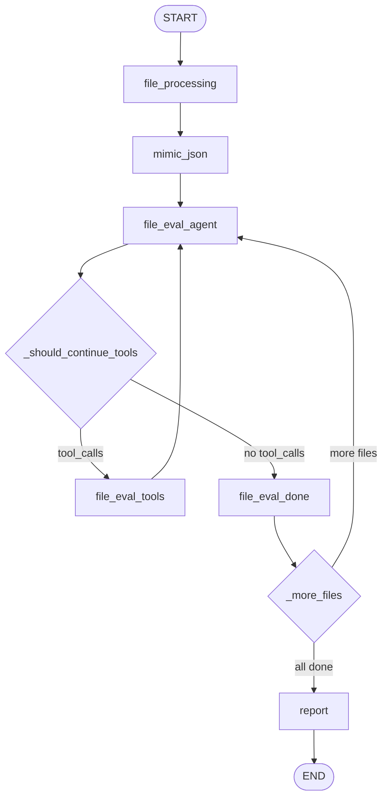
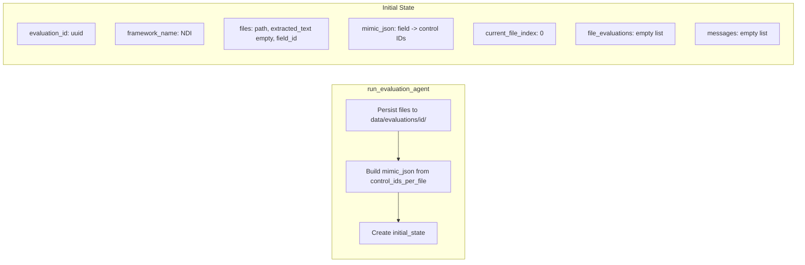
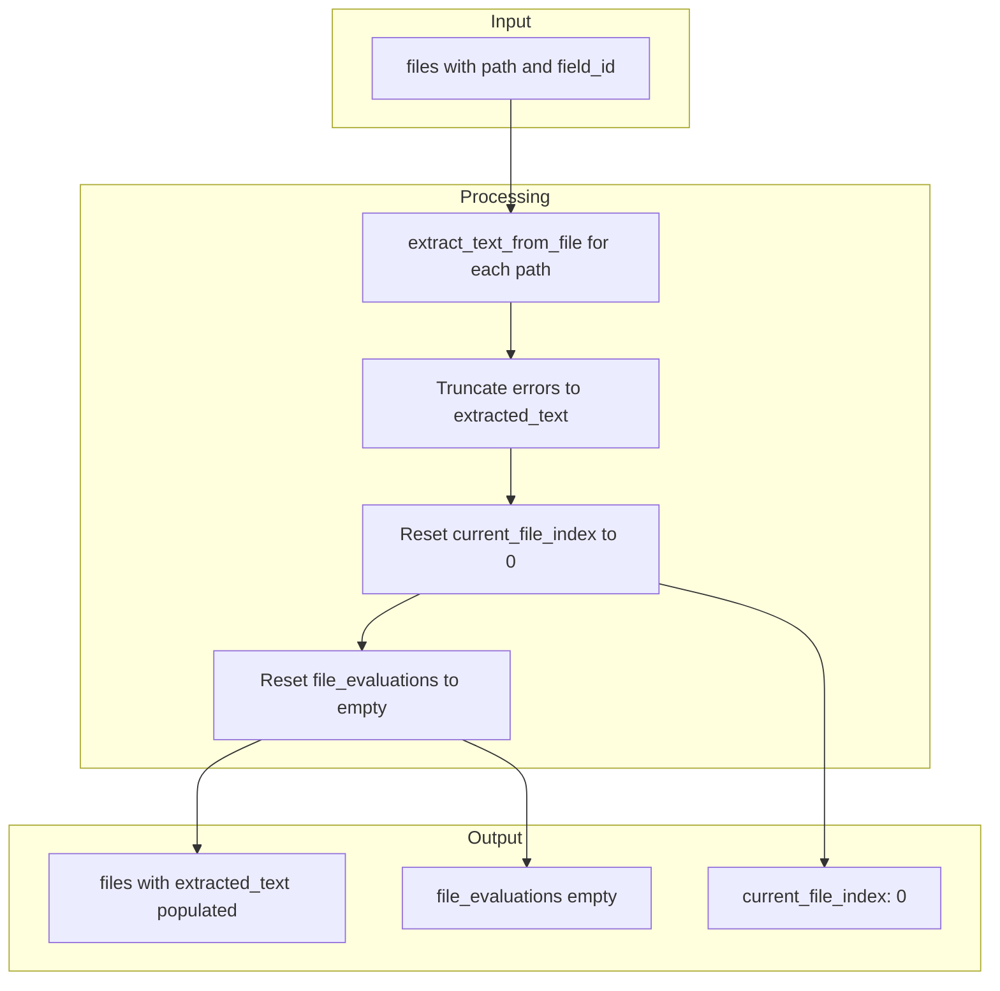
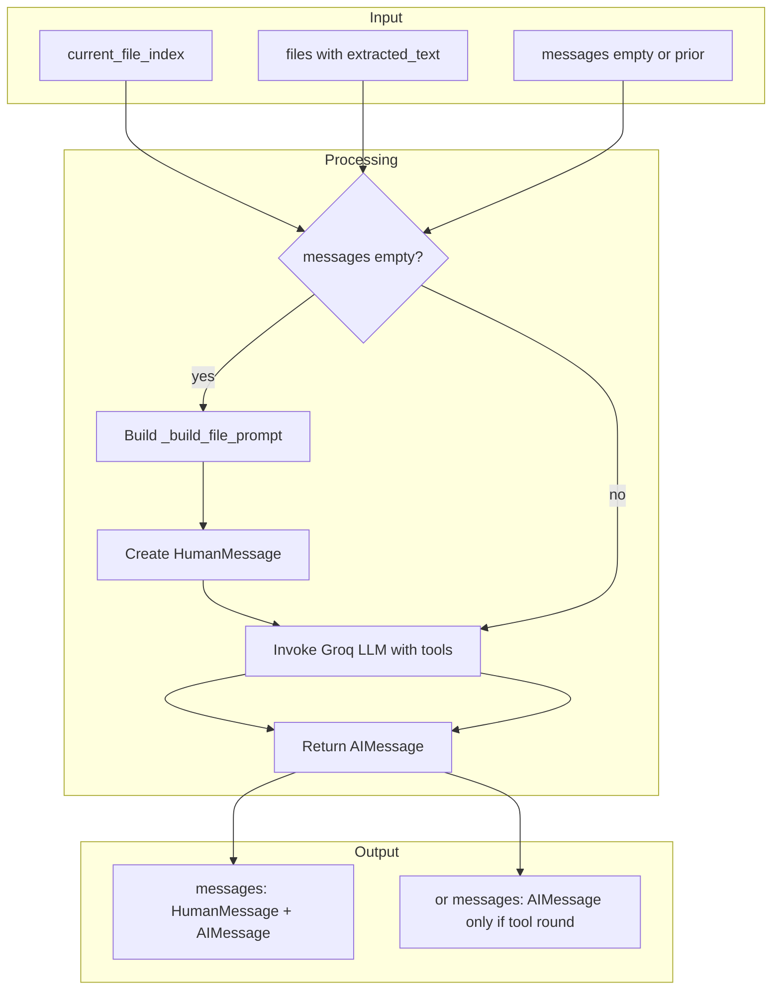
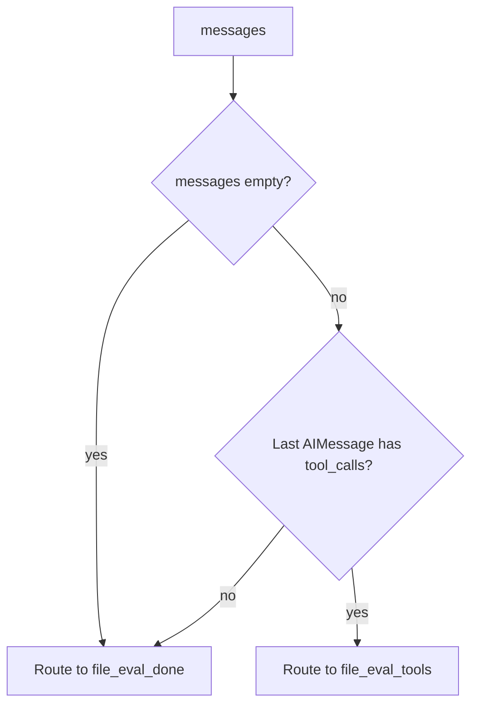
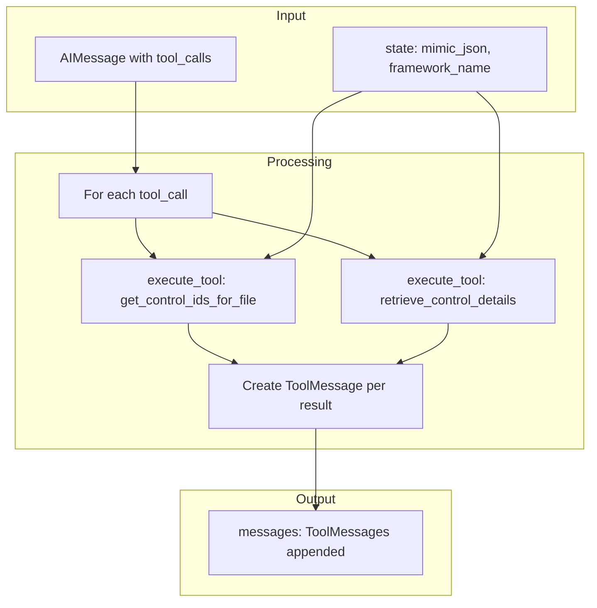
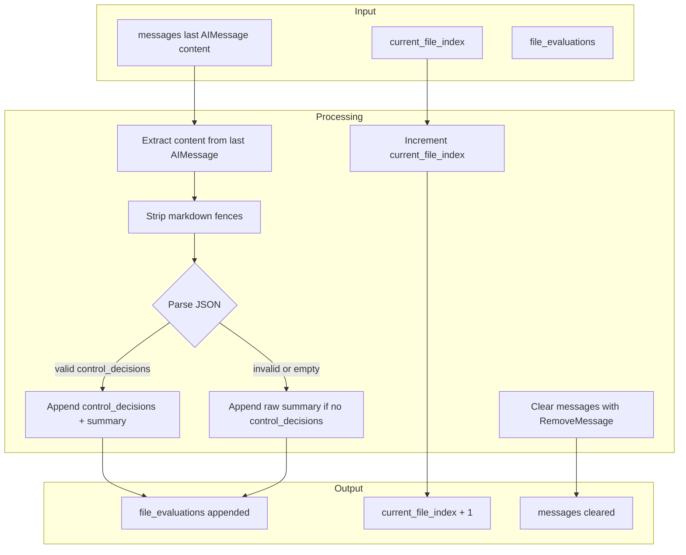
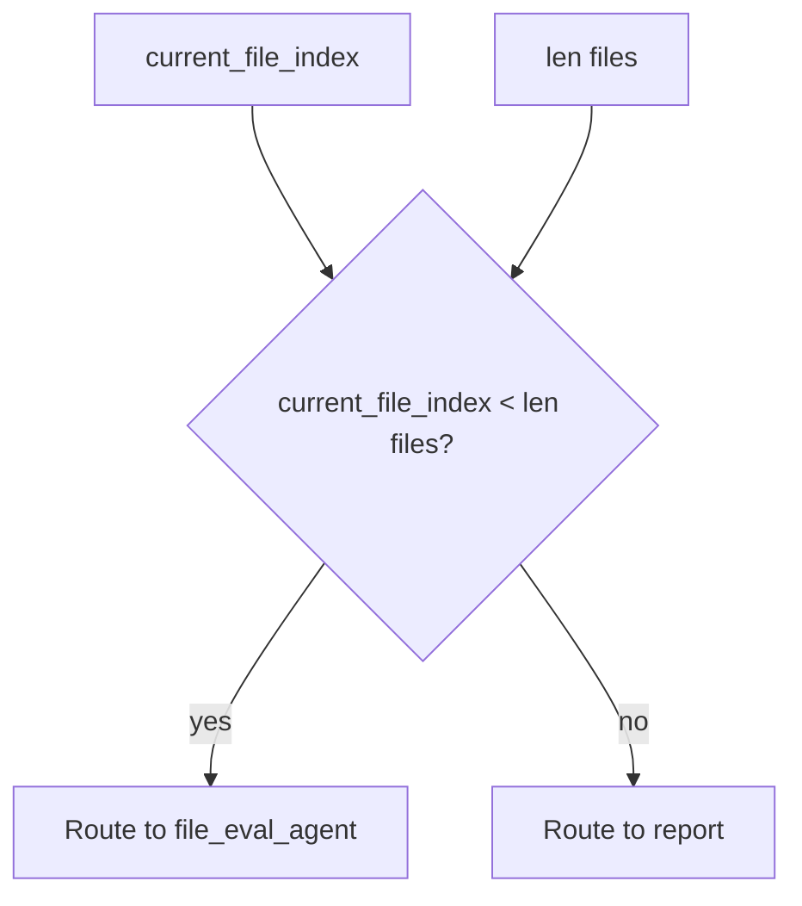
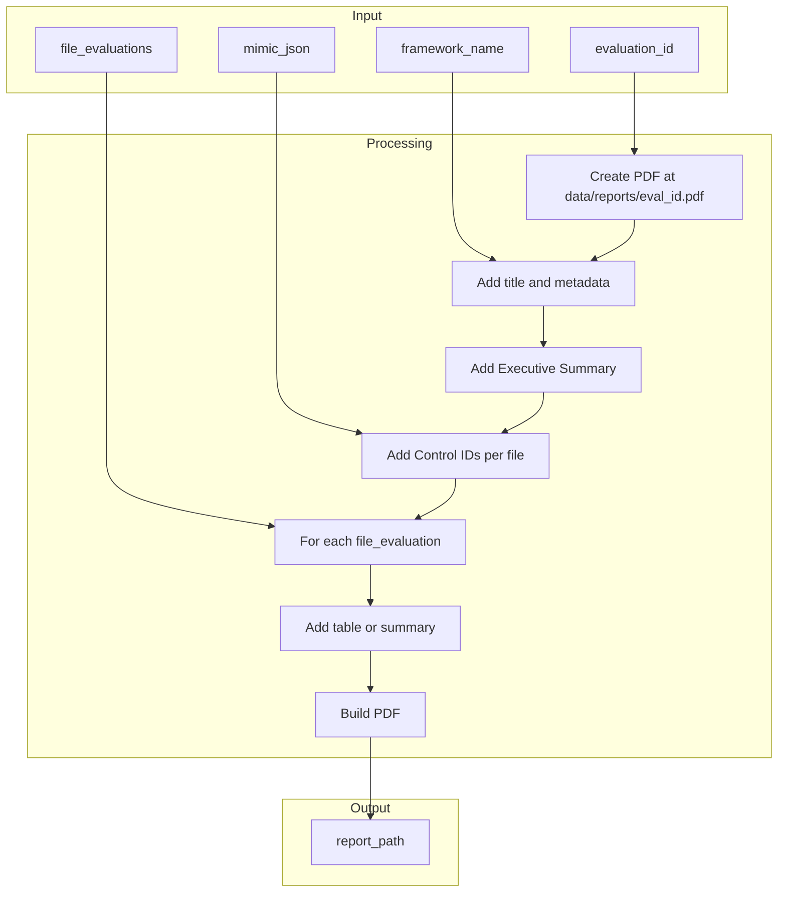
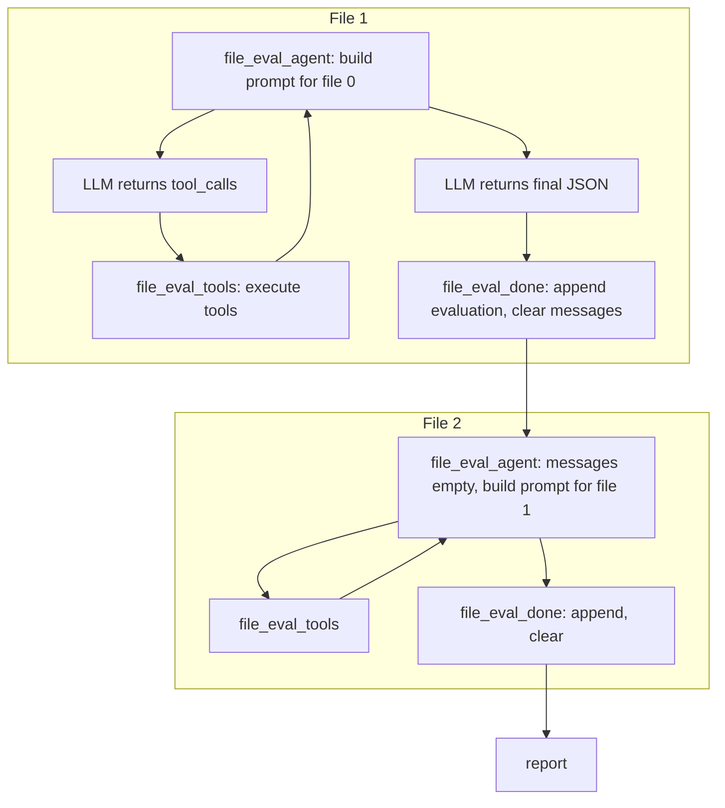

# LangGraph Evaluation Agent — Flow Documentation

This document describes the LangGraph evaluation workflow with detailed input/output and processing for each node. Aligned with `graph.py`, `state.py`, `run.py`, `tools.py`, `report.py`, and `mimic_json.py`.

---

## 1. High-Level Workflow



---

## 2. State Schema (EvaluationState)

| Key | Type | Description |
|-----|------|-------------|
| `evaluation_id` | str | UUID for this evaluation run |
| `framework_name` | str | Framework identifier (e.g. NDI) |
| `files` | list[dict] | `[{path, extracted_text, field_id}, ...]` per file |
| `mimic_json` | dict | `{framework_name: {field_1: "id1,id2", field_2: "..."}}` |
| `current_file_index` | int | Index of file being evaluated (0-based) |
| `file_evaluations` | list[dict] | Accumulated per-file results |
| `report_path` | str | Path to generated PDF |
| `errors` | list[str] | Error messages |
| `messages` | list | LLM conversation (add_messages reducer) |

---

## 3. Initial State (from run.py)



---

## 4. Node Details

### 4.1 file_processing

**Input (from state):**

| Key | Value |
|-----|-------|
| `files` | `[{path, extracted_text: "", field_id}, ...]` (extracted_text empty from run.py) |

**Processing:**

1. If `files` is empty: return `{"errors": [... "No files in state"]}` and stop.
2. For each file: call `extract_text_from_file(path)` from `src.processing` (dispatches by extension: pdf, csv, xlsx, xls, pptx, docx).
3. On exception: set `extracted_text` to `"[Extraction error: {e}]"`.
4. Overwrite `files` with result list; set `current_file_index` to 0; set `file_evaluations` to `[]`.

**Output (state update):**

```json
{
  "files": [
    {"path": "/path/to/data/evaluations/{id}/file1.pdf", "extracted_text": "...", "field_id": "field_1"},
    {"path": "/path/to/data/evaluations/{id}/file2.pdf", "extracted_text": "...", "field_id": "field_2"}
  ],
  "current_file_index": 0,
  "file_evaluations": []
}
```

**Mermaid:**



---

### 4.2 mimic_json

**Input:** State already has `mimic_json` from `run.py` (built from `control_ids_per_file`).

**Processing:** No-op. Ensures `mimic_json` is present (already set before graph invoke).

**Output:** `{}` (no state change).

---

### 4.3 file_eval_agent

**Input (from state):**

| Key | Value |
|-----|-------|
| `current_file_index` | 0, 1, ... |
| `files` | List with `extracted_text` populated |
| `messages` | Empty (new file) or prior conversation (tool round) |

**Processing:**

1. If `messages` is empty:
   - Build prompt via `_build_file_prompt(state)` (uses `current_file_index`, `files[idx]`, `framework_name`; file content truncated to 15k chars).
   - If prompt is empty (idx >= len(files)): return `{"errors": [... "No file at index"]}`.
   - Set `messages = [HumanMessage(content=prompt)]`.
2. Invoke Groq LLM via `get_groq_llm().bind_tools(get_tool_schemas())` with `messages`.
3. Append `response` (AIMessage). If starting (len(messages)==1 and HumanMessage): return `messages + [response]`; else return `[response]` (add_messages merges).

**Output (state update):**

```json
{
  "messages": [HumanMessage(...), AIMessage(content="...", tool_calls=[...])]
}
```

Or when done with tools:

```json
{
  "messages": [..., AIMessage(content="{\"control_decisions\": [...], \"summary\": \"...\"}")]
}
```

**Mermaid:**



---

### 4.4 _should_continue_tools (conditional)

**Input:** `messages` (from state).

**Logic:**

- If `messages` is empty → `"file_eval_done"`
- Else if last message is AIMessage and has `tool_calls` → `"tools"`
- Else → `"file_eval_done"`

**Mermaid:**



---

### 4.5 file_eval_tools

**Input (from state):**

| Key | Value |
|-----|-------|
| `messages` | Last message is AIMessage with `tool_calls` |
| `mimic_json`, `framework_name` | For `execute_tool` (get_control_ids_for_file) |

**Processing:**

1. If last message is not AIMessage or has no `tool_calls`: return `{}` (no state change).
2. For each tool call in last.tool_calls:
   - `execute_tool(dict(state), name, args)`:
     - `get_control_ids_for_file(field_id)` → string (comma-separated IDs).
     - `retrieve_control_details(control_id, framework_name, top_k_pdf?)` → dict; serialized via `json.dumps` for ToolMessage content.
   - On exception: content = `str(e)`.
   - Create ToolMessage(content, tool_call_id=tid).
3. Return `{"messages": tool_messages}` (add_messages appends).

**Output (state update):**

```json
{
  "messages": [ToolMessage(content="DG.1.1,DG.1.2", tool_call_id="..."), ToolMessage(content="{...}", tool_call_id="...")]
}
```

**Mermaid:**



---

### 4.6 file_eval_done

**Input (from state):**

| Key | Value |
|-----|-------|
| `messages` | Last message is AIMessage with `content` (final JSON) |
| `current_file_index` | Index of just-evaluated file |
| `file_evaluations` | Prior evaluations |
| `files` | For field_id |

**Processing:**

1. Extract `content` from last AIMessage (empty string if none).
2. Strip markdown code fences (```...```) if present.
3. Parse JSON:
   - If parsed and `control_decisions` is a non-empty list: append `{file_index, field_id, control_decisions, summary}`.
   - Else if parsed: append `{file_index, field_id, summary: content}`.
   - On JSONDecodeError/TypeError: append `{file_index, field_id, summary: content}`.
4. Increment `current_file_index` by 1.
5. Return `messages: [RemoveMessage(id=REMOVE_ALL_MESSAGES)]` so add_messages clears all prior messages for the next file.

**Output (state update):**

```json
{
  "file_evaluations": [
    {"file_index": 0, "field_id": "field_1", "control_decisions": [...], "summary": "..."},
    {"file_index": 1, "field_id": "field_2", "control_decisions": [...], "summary": "..."}
  ],
  "current_file_index": 1,
  "messages": [RemoveMessage(id=REMOVE_ALL_MESSAGES)]
}
```

**Mermaid:**



---

### 4.7 _more_files (conditional)

**Input:** `current_file_index`, `files` (length).

**Logic:**

- If `current_file_index < len(files)` → `"file_eval_agent"` (more files to evaluate)
- Else → `"report"` (all done)

**Mermaid:**



---

### 4.8 report

**Input (from state):**

| Key | Value |
|-----|-------|
| `evaluation_id` | For filename |
| `framework_name` | For header |
| `file_evaluations` | All per-file results |
| `mimic_json` | Control IDs per field |

**Processing:**

1. Create `data/reports/{evaluation_id}.pdf` via ReportLab `SimpleDocTemplate`.
2. Add title, evaluation ID, framework; Executive Summary; Control IDs per file (from `mimic_json[framework_name]`, sorted).
3. For each `file_evaluations`:
   - Heading: "File N (Field: field_N)"
   - If `control_decisions` is a non-empty list: render Table (Control ID | Decision | Rationale), colWidths [70, 70, 270], cells as Paragraph for wrapping.
   - Summary: `ev.get("summary") or ev.get("evaluation")` (truncate to 2k chars); if none and no control_decisions, use `str(ev)`.
4. `doc.build(story)` and return path.

**Output (state update):**

```json
{
  "report_path": "/path/to/data/reports/{evaluation_id}.pdf"
}
```

**Mermaid:**



---

## 5. Tools Used by file_eval_agent

| Tool | Args | Returns | Notes |
|------|------|---------|-------|
| `get_control_ids_for_file` | `field_id` | str (comma-separated IDs) | From `mimic_json[framework_name][field_id]` |
| `retrieve_control_details` | `control_id`, `framework_name`, `top_k_pdf`? (default 5) | `{json_cards, pdf_chunks}` | RAG via `src.rag.retrieve_control_details` |

---

## 6. Per-File Loop (Detailed)



---

## 7. Edge Summary

| From | To | Condition |
|------|----|-----------|
| START | file_processing | Always |
| file_processing | mimic_json | Always |
| mimic_json | file_eval_agent | Always |
| file_eval_agent | file_eval_tools | `_should_continue_tools` → "tools" (last AIMessage has tool_calls) |
| file_eval_agent | file_eval_done | `_should_continue_tools` → "file_eval_done" (no tool_calls or empty messages) |
| file_eval_tools | file_eval_agent | Always |
| file_eval_done | file_eval_agent | `_more_files` → "file_eval_agent" (current_file_index < len(files)) |
| file_eval_done | report | `_more_files` → "report" (current_file_index >= len(files)) |
| report | END | Always |

---

## 8. Code References

| Component | File | Function / Class |
|-----------|------|------------------|
| Graph definition | `graph.py` | `build_evaluation_graph` |
| State schema | `state.py` | `EvaluationState` |
| Entry point | `run.py` | `run_evaluation_agent` |
| Tools | `tools.py` | `get_tool_schemas`, `execute_tool` |
| Report | `report.py` | `build_report_pdf` |
| Mimic JSON | `mimic_json.py` | `build_mimic_json` |
| Text extraction | `processing/file_dispatcher.py` | `extract_text_from_file` |
